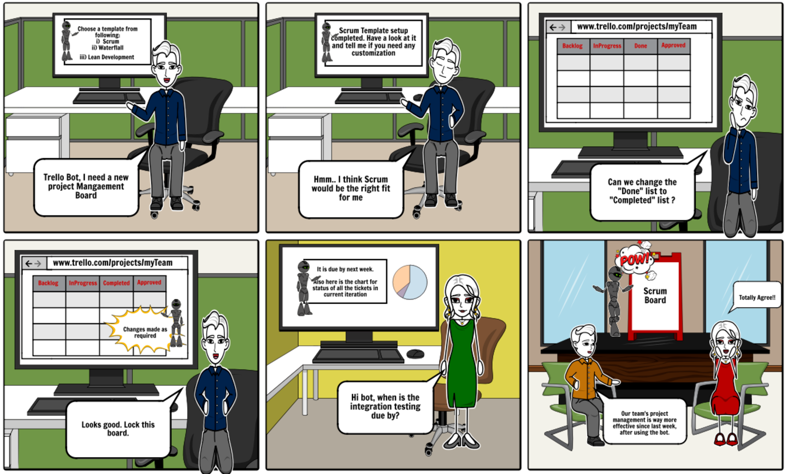
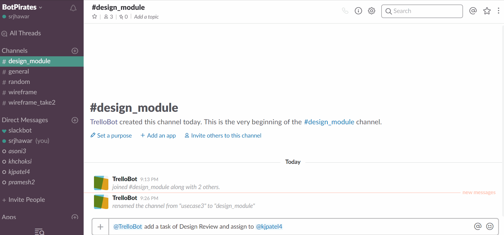
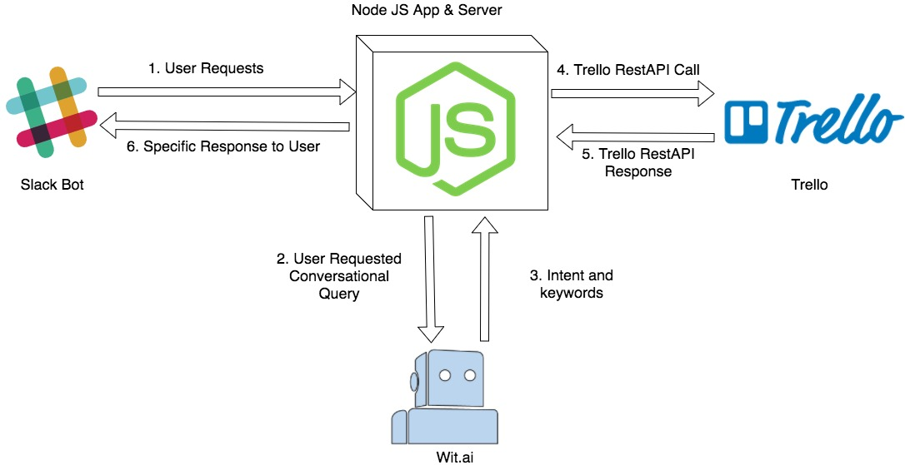

## Task Management Bot

## This is the revised design after feedback given by professor.

## 1. Problem Statement:  
  * Slack is one of the most popular team collaboration tools. Most of the leading companies are now using Slack for better communication within the team. Trello is a web application that helps with project management in the sense of giving a visual overview of tasks that need to be managed in the team. While teams communicate on Slack, and then go on to Trello to manage their task activities, we thought that bridging the gap between these two applications would make project management handy by providing Trello related functionalities right there in Slack. There could be times when task specific details are needed at some spontaneous time (during team meeting). Imagine the swiftness and control one experiences, when team member receives the relevant information like getting the due date of a particular task there itself in Slack. Thus, managing tasks in Trello can now be done without having to move away from Slack. We plan to solve this problem using a Task Management bot that will help us with use cases defined below. We hope this bot will increase the productivity within the team by decreasing the number of times a developer/manager needs to visit the Trello site and instead work his way through, from Slack.
  

## 2. Bot Description:  
  * The task management bot is a Slack based interactive conversational bot which simplifies our job of managing the Slack channel and Trello board for a single project management.  
  * The bot provides the user various alternatives to start their new board with templates related to different software development lifecycles.  
  Moreover, the user can also do modifications/personalization they require at the time of creating the new board 
  from Slack itself. So, the user doesn’t have to create individual lists for the storyboard, every time they create a new one in Trello. This way bot saves the Software Engineer the time for initial setup process and helps them to increase the productivity of the software. 
  * The manager and team members can easily look for their backlogs, on-going tasks and tasks which will have the deadline soon, 
  just by asking a simple question to the bot in the Slack for their specific requests. The user or team lead can also assign the task to other team members while also assigning a deadline to the same.
  In addition to this, the software engineer can also look for the highly prioritized tasks which he/she needs to complete with 
  highest priority. This way, the manager and other members also get updated about the task activity of team members.
  * Now, when the user has completed the task and they want to show their completed work,  they can simply attach the link (drive link/ github link) by telling the bot that they have completed with this reference. This way team lead / other team-mates can look for it to track the record when required in an organized way.  
### Bot's Design Pattern: Conversationists Bot  
  * Our bot will converse with the user and keep the conversational state intact. Since the Bot will learn from what the user wishes to do and react accordingly, we will follow the Conversationist Bot pattern.The Bot will have to remember the knowledge of the conversation in terms of what has been said from the previous conversation, in order to carry out some subtasks in some use cases.

## 3. Use Cases:  
### Use Case I : Creating story board from a template
  **(i) Preconditions:**  
   User must have a team created on the Trello and should have invited the bot into the channel for their Trello team.  
  
  **(ii) Main Flow:**  
 * User will request to create a storyboard[S1].  
 * Bot will provide list of different templates for the storyboards[S2].  
 * User selects the template for the board from the list provided earlier.[S3]  
 * After the template is chosen by the user, bot creates the template board and provides the trello lists created in the board. [S4]  
 * Bot further asks for the modifications required in the template [S5].

**(iii) Subflows**  
* [S1] User writes that "Hey @bot, can you please create a storyboard”.  
* [S2] Bot provides a list of options for the templates in the form of drop-down list having Scrum-board, Waterfall-board, …, Blank-board.  
* [S3] User can pick any one of them by selecting the list from drop-down list.  
* [S4] Bot will provide all the lists created by default in the template selected by the user.  
* [S5] Bot will further ask if user wants to do any of the following actions: 
    * Modify the name of the list
        * Bot: (Displays all Trello Storyboard lists in dropdown list)
        * User: (Can click on any one of them)
        * Bot: What is the new name that you want to keep for this list?
        * User: <X> is the new name for this list.  
        * Bot : List name has been modified.
   * Delete a list
        * Bot: (Displays all Trello Storyboard lists in dropdown list)  
        * User: (Clicks on any one of them)  
        * Bot: List has been deleted.  
   * Add a new list with some name
        * Bot: (Will show pop up with a text box.)
        * User: Gives list name.
        * Bot: Successful added list.  
   * Add text to colors for labels (for ex: User can add “High Priority” to color red and this label can be added to the cards.  
       * Bot: (Shows a popup window to give name to a colored label.)
       * User: Will type in the name of the label for each color. 
   * Add more members to the storyboard
      * Bot: (Shows a popup window to insert email ids of trello users to invite in board.)
      * User: Will type in the email address of the users they want to invite.
      * Bot: Invitations successfully sent.
   
 **(iv) Alternative Flows:**  
   * [E1] User doesn't want to do any modifications in the given template.  
  
### Use Case II : Creating / Managing Tasks  
 **(i) Preconditions:**  
  User should have already linked slack channel with the storyboard which they want to work on.
 
 **(ii) Main Flow:**  
  * Bot will provide the possible list of actions user can do after having created the storyboard [S1]
  * User will request to show their or others tasks according to different parameters like priority, deadline, back-logs.[S2] 
  * Set/update the labels of the tasks.[S3]
  
 **(iii) Sub Flows:**  
  * [S1] Bot will respond with “You have successfully setup your personalized board! Here is what you can do next: ” (Below options will come in a dropdown menu)  
     * Add a new task to a list
       * Bot: (Shows all lists in dropdown menu)
       * User: Selects one list from the dropdown and gives a name to new task.  
    * Add a due date to a task
      * Bot: (Shows all lists in dropdown menu)
      * User: Select a list from dropdown.
      * Bot: (Shows all tasks in selected list)
      * User: Select a task and sets the deadline for that task.
    * Add members to a task
      * Bot: (Shows all lists in dropdown menu)
      * User: Select a list from dropdown.
      * Bot: (Shows all tasks in selected list)
      * User: Select a task and gives name of the members.  
  * [S2] User requests that "Which tasks are due tomorrow?", "Which tasks @user1 completed today?", "Task XYZ is assigned to which team-mates?", "Which tasks are running in backlog and 
  * [S3] User requests that "I want to set RED label to task XYZ."  
 
### Use Case III : Attachment to the tasks 
 **(i) Preconditions:**  
   User should have already created a card and always have to refer the cards to insert, remove or comment on the link.  

 **(ii) Main Flow:**  
  * User can add the links which they have referred to accomplish the task.[S1]    
  * User can change the status of the task to completed by providing the commit link on GitHub or related links to show the completion of the task.[S2]
  * User can fetch all the links and comments on the particular links.[S3]  
  
 **(iii) Sub Flows:**  
  * [S1] User can log that “I have used https://abc.xyz link to solve my bug while working on task ABC.”  
  * [S2] User can say that "I have completed task XYZ and here is my commit id: 8c897ffs897"  
  * [S3] User requests that "Which links @user1 had referred to complete the task?”, “Which link @user2 had given while completing the task XYZ?”.  
  
  
 
## 4. Design Sketches:   

### Storyboard

### Wireframe Part 1   
  

### Wireframe Part 2  

## 5. Architecture Design: 

### Architecture Design Diagram  
 

### Architecture Components  
 * **Slackbot :**  
Slack user interface where the user interacts with the chat bot. User can input the commands in a natural conversational language.
 * **NodeJS Application :**  
This application will be connected to the slack channel via botkit using slackbot API token. It uses Slack's Real Time Messaging API(RTM). The inputs from slack will be forwarded to Wit.AI module. Wit.AI output is received, processed and corresponding trigger is sent to Trello via API calls. 
 * **Wit.ai :**    
Wit is a semantic analysis tool. In our use case, when user enters a sentence (slack message) about performing certain action in trello, it will interpret the meaning and the intent of the statement. Wit will take care of parsing sentences to work out the intent as well as any entities that are referred to. This data is forwarded back to the NodeJS application. 
 * **Trello :**   
Trello API will then perform the required actions and send the feedback/response to application and it is then forwarded to Slack UI via API calls.  
   

### Constraints:  
  * **Slack:**  
  At any point of time, there can be only one Trello board connected to Slack channel.
   So, if we want to manage different boards simultaneously, we should set the particular board apriori through the bot.  
     
    To add a member in a task, that member should be a Slack member of the team also.
   * **Trello:** There should be a team already created in Trello.
   
   
### Design Pattern:    
**(i) Observer**  
 * The most relevant design pattern would be “Observer” pattern. The project consists of different components whose properties are interrelated with each other. Change in one object’s state would have a direct impact on another, and hence the observer pattern would be the most appropriate.  
  
 * Ex: If a ticket’s status is changed from In Progress to Completed, correspondingly the items in both the list objects (In Progress, Completed) containing the tickets need to be modified.

 **(ii) Mediator**  
 * A mediator object that defines how other objects interact could also be useful.  
   
 * Ex: The object responsible for parsing the input sentence(wit.ai), need not have any	 direct interaction with the object creating trello cards. Thus there needs to be a mediator that acts as a central interface between different objects/modules in the bot.  
   
 **(iii) Factory**  
 
* When the user requests a certain change in the project management board, the user/client need not be exposed to the underlying objects responsible for different functionalities. Thus abstractions that are offered by the Factory pattern may also apply for our bot.

## Additional Patterns:
 * We will be using the Pipe and Filter Architecture pattern for our bot. Since, our data flows from Slack to Trello through different components in between and simulates stream processing of data, we believe Pipe and Filter architecture will be the most suitable pattern for our bot.

   
## [Team Information] 
Team information can be found [here!](https://github.ncsu.edu/asoni3/CSC510-Project/blob/master/Teaminfo.md)
